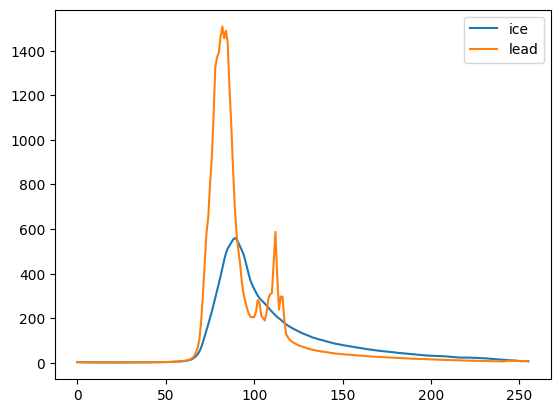

<!-- PROJECT LOGO -->
 

  

  <h1 align="center">Sentinel Satellite (2 and 3) Co-location and Unsupervised Machine Learning</h1>
  <h4 align="center">
    Code to co-locate images and altimetry data from the Sentinel satellites,
    followed by visualisation (via K and GMM-means clustering) and the
    classification of echoes in leads and sea ice.
  </h4>

<!-- ABOUT THE PROJECT -->
## About The Project
This project was produced inside the Jupity Notebook and Google Colab ecosystem. it is segmented into three principle parts.
Firstly, the fetching and colocation of Sentinel 2 and Sentinel 3 data from Google Earth Engine and the Copernicus Space 
Database. Secondly, once co-located and downloaded, K-means and GMM-means clustering is utilised, these are types of unsupervised learning 
algorithms used for partitioning a dataset into a set of groups, or clusters. This code does not serve to explain the mechanisms
of these in detail, and far superior descriptions are avaliable online. Thirdly, is the characterisation of altimeter echoes colocated from 
the satellites, which are used to characterise the echoes of sea ice and lead, as well as a variety of ice-surfaces based on the quality of 
roughness. 

To gather the dataset that you desire, first run the colocation code, and then to process it use the means clustering and classification code. 

(<a href="#readme-top">back to top</a>)

### Built With

- Google Colab
- Jupityr Notebook
- Python 3
- scikit.learn
- TensorFlow
  

(<a href="#readme-top">back to top</a>)

<!-- GETTING STARTED -->
## Getting Started

This project operates predominantly within the Google Colab/ Jupityr Notebook enviornment. This youtube tutorial succintly explains how to get this working if you are previously unfamiliar:

The thrust of this project lies in K and GMM means clustering, a complicated element within the obfuscated field of artifical intellenge. This tutorial explains the mathematical and practical basis and application of these to image and altimetry data:

**I reccomend that you watch both of these tutorials before you attempt to run this code!**

## What I Produced!

I used this code to colocate a section of the Antarctic, classify the optical data into the bounds of sea-ice and lead, and then classified the altimetry data to produce characteristic echoes for, again, sea-ice and lead. Below are the products of the code as written!

